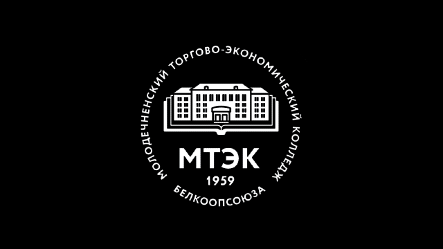

<div align="center">
  <h1>📅 MTEC Schedule Bot</h1>
</div>

<div align="center">
  <strong>Неофициальный Telegram бот для отслеживания расписания МТЭК</strong>
</div>

<br>

<div align="center">
  
</div>

<div align="center">
  <a href="https://python.org/">
    
  </a>
  <a href="https://aiogram.dev/">
    
  </a>
  <a href="https://www.docker.com/">
    
  </a>
  <a href="https://github.com/temm-dev/mtec-schedule-bot">
    
  </a>
</div>

## ✨ Возможности

- 📲 **Автоматическое расписание** - получайте обновления сразу
- <strike>🔔 **Уведомления** - узнавайте об изменениях первыми</strike> <b><u># Не доступно</u></b>
- 📖 **Электронный журнал** - оценки и посещаемость
- 👥 **Расписание группы/преподавателя** - получайте расписание групп и преподавателей
- ⚙️ **Настройки** - персонализируйте бота

## 🤖 Команды бота

| Команда | Описание |
|---------|----------|
| `/start` | Запуск бота и главное меню |
| `/schedule` | Отправить расписание |
| `/journal` | Электронный журнал |
| `/group_schedule` | Расписание группы |
| `/mentor_schedule` | Расписание преподавателя |
| `/settings` | Настройки бота |
| `/change_journal_info` | Изменить данные электронного журнала |
| `/delete_journal_info` | Удалить данные электронного журнала |
| `/restart` | Перезапуск бота |
| `/exit` | Отменить действие |

## 🛠️ Команды для разработки

```bash
make install    # Установить зависимости
make run        # Запустить бота
make format     # Форматировать код
make lint       # Проверить код
```

## 🐳 Docker команды

```bash
make docker-build   # Собрать образ
make docker-run     # Запустить контейнер
make docker-stop    # Остановить контейнер
```

## 📋 Что нужно

- Python 3.13+
- Docker (опционально)
- Токен Telegram бота
- ID Telegram администратора
- Криптографический ключ для шифрования данных

## 🔧 Шаги настройки бота


### 0. Получить необходимые данные

- Токен Telegram бота [# Как получить токен?](https://botifi.me/ru/help/telegram-create-bot/)
- ID Telegram администратора [# Как получить ID?](https://t.me/userinfobot)
- Криптографический ключ

#### Создание криптографического ключа:
```python
from cryptography.fernet import Fernet

# Генерация ключа
key = Fernet.generate_key()

# Вывод ключа (выглядит как набор случайных байтов в base64)
print(f"Ваш ключ: {key.decode()}")
```

### 1. Добавить данные в конфиг

```src/bot/config/bot_config.py```
```python
TOKEN: Final[str] = "токен"

SECRET_KEY: Final[str] = "ключ"

ADMIN: Final[int] = 000000000
```

### 2. Запустить бота

#### С Docker (Рекомендуется)
```bash
git clone https://github.com/temm-dev/mtec-schedule-bot.git
cd mtec-schedule-bot
make deploy
```

#### Без Docker
```bash
git clone https://github.com/temm-dev/mtec-schedule-bot.git
cd mtec-schedule-bot
make install
make run
```

## 🏗️ Технологии

- **Python 3.13**
- **Aiogram 3**
- **SQLAlchemy**
- **Docker**

---

<div align="center">
  Сделано с ❤️ для студентов МТЭК<br>
  <a href="https://github.com/temm-dev">temm-dev</a>
</div>